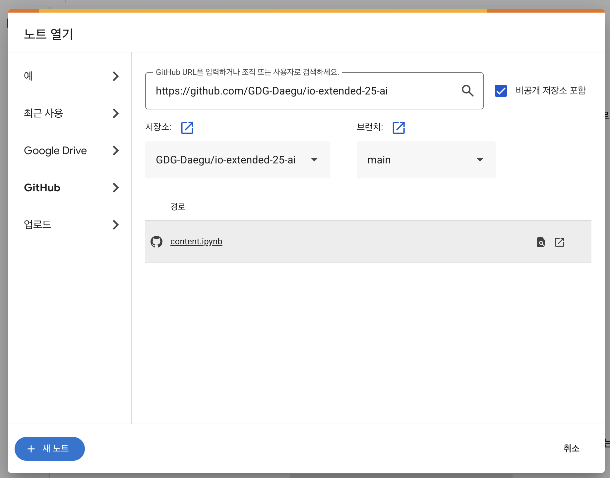

# io-extended-25-ai
Google I/O Extended in Uiseong 2025 핸즈온 세션

## 🤖 AI 세션 (총 1시간)

**세션 목표:** I/O 2025에서 발표된 차세대 모델 Gemini 2.5 Pro의 핵심 기능인 '네이티브 멀티모달'을 직접 체험하고, Google AI Studio를 통해 아이디어를 실제 애플리케이션으로 연결하는 과정을 학습합니다.

### **사전 준비사항**

[실습 준비하기](./PREPARE.md) 페이지에서 실습에 필요한 모든 준비를 마쳐주세요.

### **실습 콘텐츠**

아래 링크는 실제 세션에서 사용할 Google Colab 파일입니다. 참가자들은 링크에 접속하여 코드를 직접 실행하며 실습을 진행하게 됩니다.

**[➡️ AI 세션 실습](https://colab.research.google.com/)**

링크에 접속하여 GitHub 저장소에서 content.ipynb 파일을 열어주세요.
혹은 다운 받은 후 colab에 추가바랍니다.

